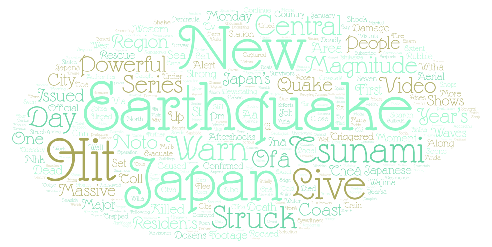
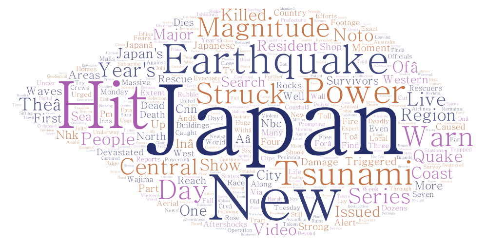

# Geog 458 Lab 2
## Topic
The topic I chose for this lab assignment is the geographic topic of Japan's  earthquakes, as the most recent one occurred on New Years in the Noto Peninsula. The reason I chose this topic is beacuse Japan is known for earthquakes, with the most popular one being the 2011 earthquake, also know as the "Great East Japan Earthquake". With its history of earthquakes, I wanted to see the differences in search results when searching with and without the date included in the search query as I wanted to see how the results would differ. This recent earthquake however was not as strong, reporting with a magnitude of 7.6. I have created 2 word clouds that visualizes the terms that appeared the most from each youtube query.

##### Parameters Used

1. Noto Earthquake (2024)
- "Japan 2024 Earthquake"
- "Noto Earthquake"
2. Japan Earthquake (general)
- "Japan Earthquake"

##### Purpose
With the recent earthquake, I wanted to see what were the most frequent related terms when searching up about the 2024 Japan earthquake and the differences in results when including the year in the search query.

##### Analysis
Word Cloud 1:

Word Cloud 2:

Data:
- [Dataset 1](./assests/search-result-1.csv)
- [Dataset 2](./assests/search-result-2.csv)

Aside from the main terms such as "Japan" and "Earthquake", we can observe that the word "Tsunami" also appears often, as well as "New". For the case of "Tsunami", tsunamis are giant waves caused by earthquakes under the sea so it is not surprising to see that it is one of the more frequent terms that appear, especially since the 2011 9.0 magnitude earthquake generated a huge tsunami with waves up to 11 to 12 feet and killed at least 20000. Another interesting term is the word "New" that appears in both word clouds, which means that although no matter how popular the 2011 earthquake was, newer events related to the search query will appear first. Youtube's algorithm could also have an affect on the results of the search query as we may not know how the algorithm works.

##### Findings and Improvements
Reflecting on this assignment, most of them terms on the word clouds are just as I expected. The main thing I expected to see was the term "Tsunami", but I expected more about the 2011 earthquake, but it seems that newer events tend to appear first as a resut of youtube's algorithm. I think that my research could be improved using a place with more related events, as Japan is mmostly related to Earthquakes than any other geographical event.